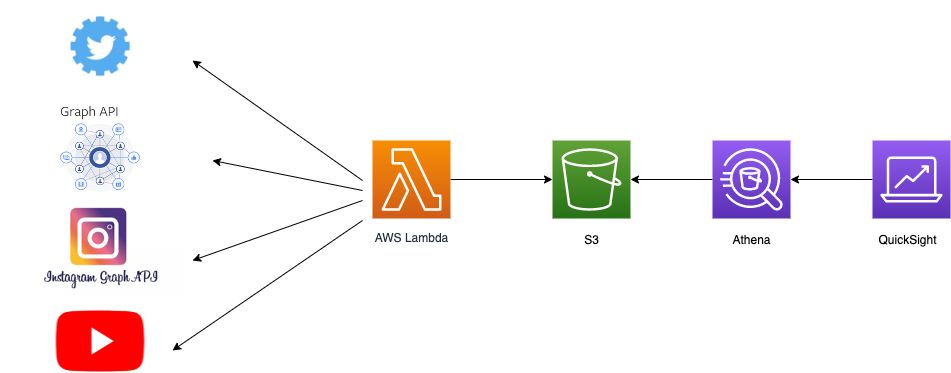

## 調査報告

- [FaceBook](facebook/facebook-api.md)
- [Twitter](twitter/twitter-api.md)
- [Instagram](instagram/instagram-api.md)
- [Youtube](youtube/youtube-api.md)

- [データ可視化ツール](./tools/visualization_tool.md)
- [データベース](./tools/database.md)
- [サーバー](./tools/server.md)

## APIで取得できる情報

- Facebook

  FaceBook グラフAPIで取得できる情報一覧: [detail](https://developers.facebook.com/docs/graph-api/reference/v13.0/url)

  制限: 
    > GETリクエストの上限は、1つのアプリ、1つのURLにつき、1時間あたり10件です。

  - id: URL自体
  - engagement: ユーザーがURLを操作した方法の数
    - comment_count: URLに付けられたコメントの数
    - comment_plugin_count: サイトのコメントプラグインを使用して収集された、プラグインに対するコメントの数。
    - reaction_count: URLに対するリアクションの数。
    - share_count: URLがシェアされた回数。
  - og_object: このURLに対して正規に関連付けられているOpen Graphオブジェクト
    - id: オブジェクトのID
    - description: オブジェクトの説明
    - titele: オブジェクトのタイトル
    - type: オブジェクトタイプ
    - updated_time: オブジェクトの最終更新日時


- Twitter
  Twitter Enterprise -Gnip2.0 で取得できる情報一覧: [detail](https://developer.twitter.com/en/docs/twitter-api/enterprise/engagement-api/overview)

  情報が多いので一部抜粋
  - impressions: 表示回数
    > A count of how many times the Tweet has been viewed. This metric is only available for Tweets that have been posted within the past 90 days.
  - engagements: エンゲージメント
    > A count of the number of times a user has interacted with the Tweet. This metric is only available for Tweets that have been posted within the past 90 days.
  - favorites
  - retweets
  - quote_tweets
  - replies
  - video_views
  - media_views
  - media_engagements
  - url_clicks

- Instagram

Instagram Graph APIの記事: https://dev.classmethod.jp/articles/instagram-graph-api-approved-for-review/

- Youtube

- Architecture

## pip package update

Pip can be used to upgrade all packages on either Windows or Linux (and Mac OS X).):

1. Output a list of installed packages into a requirements file (requirements.txt): 
  `pip freeze > requirements.txt`
2. Edit requirements.txt, and replace all ‘==’ with ‘>=’. Use the ‘Replace All’ command in the editor.
3. Upgrade all outdated packages: 
  `pip install -r requirements.txt --upgrade`

[References](https://www.activestate.com/resources/quick-reads/how-to-update-all-python-packages/)

## Visual Studio Code Python Intelligence 

pip で install したパッケージ関連でエラーが出たのを解消した手順

setting.json に 以下を加えるだけ

```
"python.analysis.extraPaths": ["./sources", "lib/python"],
```

[参考](https://github.com/microsoft/pylance-release/issues/29)
